# URP_UberEffect

Effect Shader with common feature in Unity Universal Pipeline

## About The Shader

|功能类|功能选项概览|功能预览|
|-|-|-|
|MainTex类|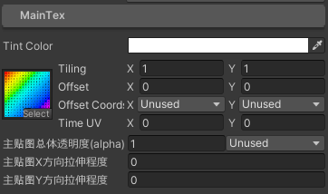|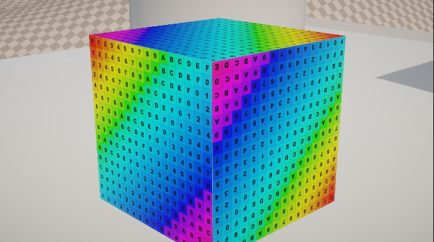|
|MaskTex类|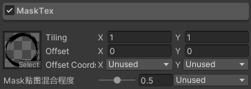|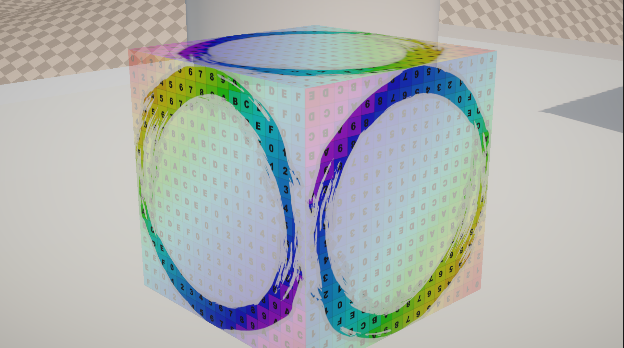|
|DissolveMap类Case1|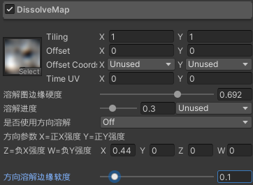|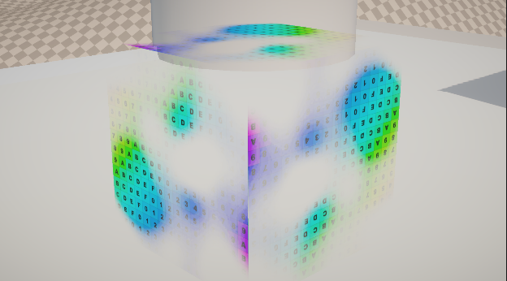|
|DissolveMap类Case2|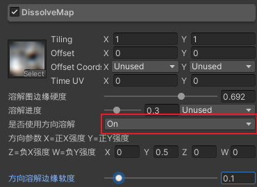|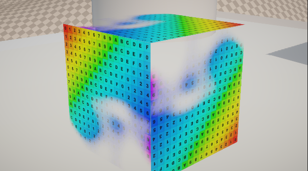|
|FlowMap类|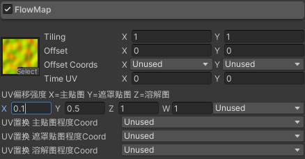|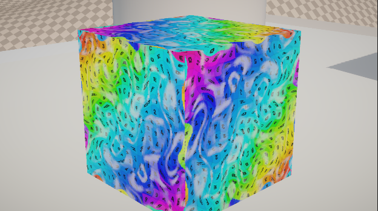|
|Rim类|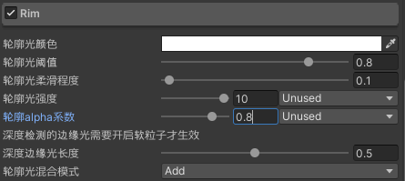|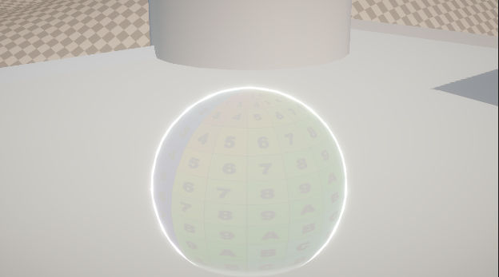|
|VertDisplacement类|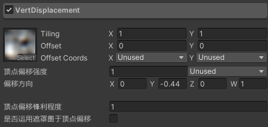|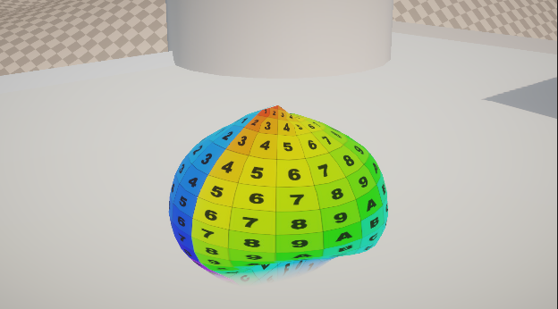|
|SoftParticle类|未开启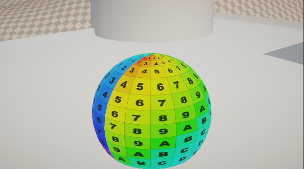|开启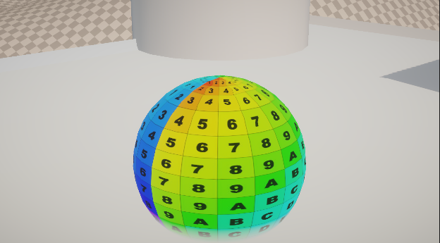|
|SceneLighting类|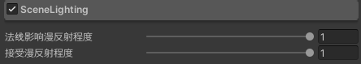|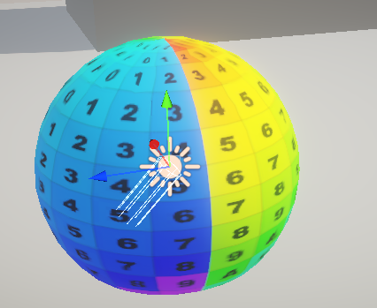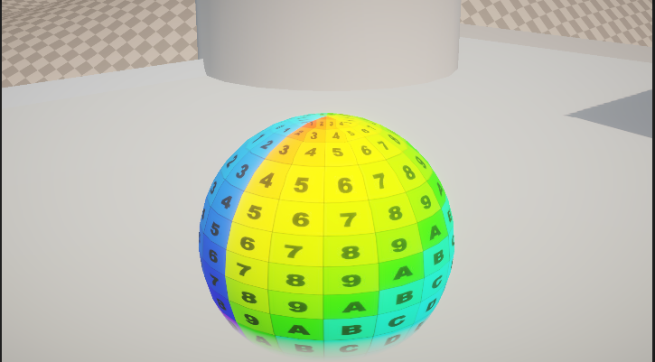|
## Installation
将UberEffect文件夹放入Unity工程中任意位置,创建材质球使用shader: (`Distony/URP/UberEffect`)
软粒子和其他需要深度的功能需要URP管线开启深度图情况才可以使用.
材质面板中关于CustomCoord的使用
1. 可以利用ObjectTween脚本传入值
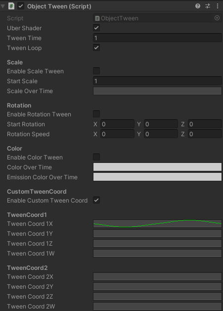
2. 可以利用unity的粒子系统Particle System的CustomData把值传入
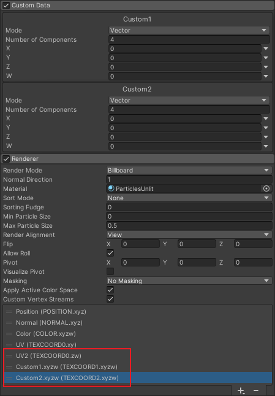